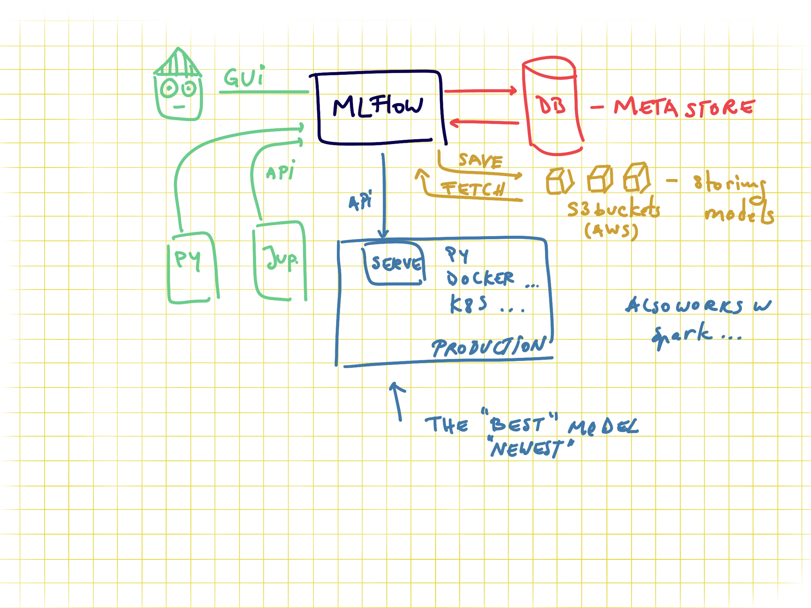
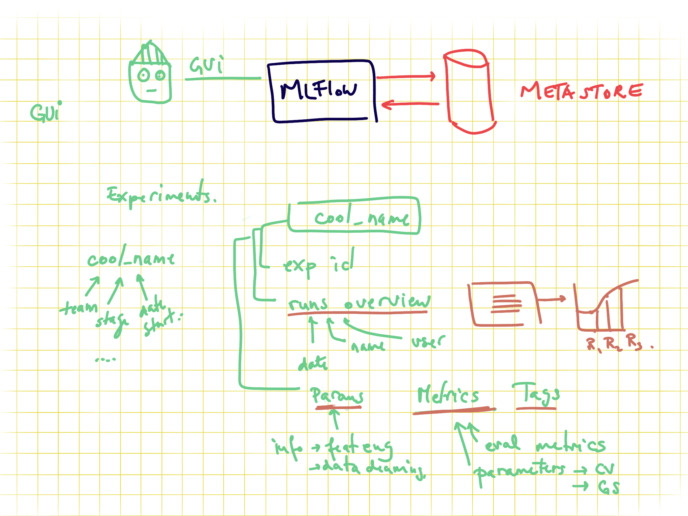
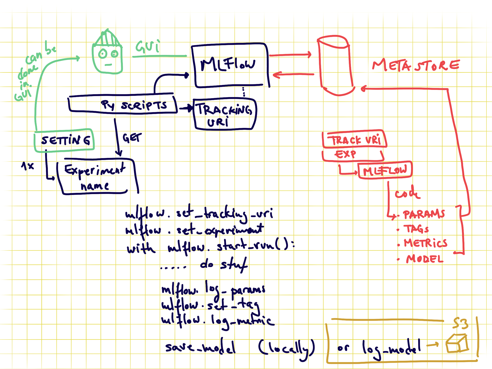
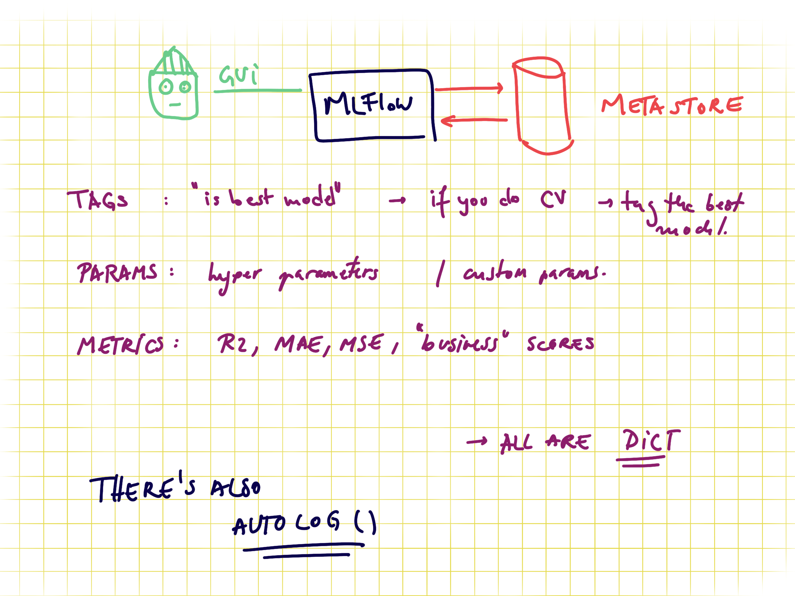

# SelfPower 

Project Overview 

Title: Optimizing Self-Sufficiency in Energy Transition: A Cost-Effective Model for Small-Scale Renewable Energy Systems 

Objective: 

Develop a mathematical model and decision-support tool that helps individuals or small businesses design a cost-effective renewable energy system (solar, wind, or a hybrid) that is self-sustaining and financially viable without relying on government subsidies. 

 

Step-by-Step Breakdown 

Layer 1: Energy System Modeling 

Concept: You’ll create a model for a small-scale renewable energy system that includes options for solar, wind, and battery storage.  

Parameters:  

Solar panel output (based on location, panel efficiency, angle of installation, etc.).  

Wind turbine performance (depending on local wind speed and turbine specifications).  

Energy consumption profiles (how much energy the individual or business consumes per day, month, year).  

Battery storage (to store excess energy for cloudy days or calm winds).  

Mathematics: Use CFD models for wind energy potential and solar radiation modeling for different regions, calculating the optimal system size and energy mix that minimizes cost and maximizes output.  

Goal: Simulate a small-scale hybrid renewable energy system for a residential or small business setup, calculating:  

Optimal capacity (how many solar panels, wind turbines, and batteries).  

Expected energy production over time.  

Initial investment vs long-term savings.  

 

Layer 2: Financial Modeling for Cost-Effectiveness 

Concept: The challenge is not just technical; you’ll also need to model the financial side of the transition. This layer will help individuals/businesses make informed financial decisions.  

Inputs:  

Initial investment cost: Cost of installation, equipment (panels, turbines, batteries).  

Operational and maintenance costs: For solar panels, turbines, and batteries over the life of the system.  

Energy prices: Current and projected energy costs from the grid.  

Return on Investment (ROI): How long it takes to break even on the initial investment, and when the system will become profitable.  

Optimization Model:  

Use cost-benefit analysis to calculate the payback period and net present value (NPV) of different system configurations.  

Compare solar-only, wind-only, and hybrid systems in terms of cost efficiency, energy independence, and long-term sustainability.  

Incorporate factors like energy price fluctuations (which could influence when grid energy becomes more or less attractive compared to self-generation).  

Goal: Develop a model that balances initial costs with long-term savings, helping users make the decision to switch to renewables while minimizing financial risk.  

 

Layer 3: Self-Sufficiency Strategy 

Concept: This part of the project will explore how to reduce reliance on government subsidies and become truly self-sufficient.  

Approach:  

Scenario Analysis: Assess how different energy production mixes (solar, wind, or both) allow individuals/businesses to reduce their grid dependence.  

Autonomy: Identify the level of energy autonomy that can be achieved—how much of the energy needs can be met through renewables alone, and how much reliance can be placed on battery storage or backup systems.  

Cost vs Autonomy: Create a break-even model that shows the cost-effectiveness of achieving complete self-sufficiency with renewables.  

Financial Independence without Government Subsidies:  

Include realistic financing options for individuals to invest in solar or wind energy, such as loans, crowdfunding, or private investments.  

Explore peer-to-peer energy trading systems or community renewable energy cooperatives where small businesses and homes can share excess energy.  

Goal: Show how people and businesses can reduce their grid dependency, use renewables for 100% of their energy needs, and become self-reliant without relying on subsidies, especially if those subsidies decrease over time.  

 

Layer 4: Decision-Support Tool / Dashboard 

Concept: You’ll build a user-friendly web app or dashboard that integrates all the models you’ve developed, allowing users to input their own energy consumption and geographic location, and get:  

A tailored renewable energy system design (how many solar panels, wind turbines, and batteries).  

A detailed cost analysis (including investment, savings, and ROI).  

A timeline showing when the system will become financially self-sustaining.  

The degree of autonomy achievable, based on different energy mixes.  

Tools:  

Streamlit or Dash for building the interactive dashboard.  

Plotly for interactive charts (ROI over time, energy savings, autonomy levels).  

Goal: Provide a real-time, interactive tool that individuals/businesses can use to calculate their own transition to renewable energy, helping them understand both the technical and financial aspects of the energy transition process.  

## Requirements:

- pyenv with Python: 3.11.3

### Setup

Use the requirements file in this repo to create a new environment.

```BASH
make setup

#or

pyenv local 3.11.3
python -m venv .venv
source .venv/bin/activate
pip install --upgrade pip
pip install -r requirements_dev.txt
```

The `requirements.txt` file contains the libraries needed for deployment.. of model or dashboard .. thus no jupyter or other libs used during development.

The MLFLOW URI should **not be stored on git**, you have two options, to save it locally in the `.mlflow_uri` file:

```BASH
echo http://127.0.0.1:5000/ > .mlflow_uri
```

This will create a local file where the uri is stored which will not be added on github (`.mlflow_uri` is in the `.gitignore` file). Alternatively you can export it as an environment variable with

```bash
export MLFLOW_URI=http://127.0.0.1:5000/
```

This links to your local mlflow, if you want to use a different one, then change the set uri.

The code in the [config.py](modeling/config.py) will try to read it locally and if the file doesn't exist will look in the env var.. IF that is not set the URI will be empty in your code.

## Usage

### Creating an MLFlow experiment

You can do it via the GUI or via [command line](https://www.mlflow.org/docs/latest/tracking.html#managing-experiments-and-runs-with-the-tracking-service-api) if you use the local mlflow:

```bash
mlflow experiments create --experiment-name 0-template-ds-modeling
```

Check your local mlflow

```bash
mlflow ui
```

and open the link [http://127.0.0.1:5000](http://127.0.0.1:5000)

This will throw an error if the experiment already exists. **Save the experiment name in the [config file](modeling/config.py).**

In order to train the model and store test data in the data folder and the model in models run:

```bash
#activate env
source .venv/bin/activate

python -m modeling.train
```

In order to test that predict works on a test set you created run:

```bash
python modeling/predict.py models/linear data/X_test.csv data/y_test.csv
```

## About MLFLOW -- delete this when using the template

MLFlow is a tool for tracking ML experiments. You can run it locally or remotely. It stores all the information about experiments in a database.
And you can see the overview via the GUI or access it via APIs. Sending data to mlflow is done via APIs. And with mlflow you can also store models on S3 where you version them and tag them as production for serving them in production.


### MLFlow GUI

You can group model trainings in experiments. The granularity of what an experiment is up to your usecase. Recommended is to have an experiment per data product, as for all the runs in an experiment you can compare the results.


### Code to send data to MLFlow

In order to send data about your model you need to set the connection information, via the tracking uri and also the experiment name (otherwise the default one is used). One run represents a model, and all the rest is metadata. For example if you want to save train MSE, test MSE and validation MSE you need to name them as 3 different metrics.
If you are doing CV you can set the tracking as nested.


### MLFlow metadata

There is no constraint between runs to have the same metadata tracked. I.e. for one run you can track different tags, different metrics, and different parameters (in cv some parameters might not exist for some runs so this .. makes sense to be flexible).

- tags can be anything you want.. like if you do CV you might want to tag the best model as "best"
- params are perfect for hypermeters and also for information about the data pipeline you use, if you scaling vs normalization and so on
- metrics.. should be numeric values as these can get plotted



## Development Notes

### Handling Merge Conflicts in Jupyter Notebooks

When working collaboratively, merge conflicts may occur in `.ipynb` files because notebooks are stored as JSON.  
To simplify resolving these conflicts, this project uses **nbdime** (already included in `requirements_dev.txt`).

#### Enable once
After setting up your environment, enable nbdime for Git:
```bash
nbdime config-git --enable
```

#### When a merge conflict occurs
Run the following command to open the merge tool:
```bash
nbdime mergetool
```
A browser window will open showing both notebook versions side by side.
Select the correct cells, save, and then complete the merge:
```bash
git add <notebook>.ipynb
git commit -m "Resolve notebook merge conflict"
```
That’s it — clean merges for notebooks!
